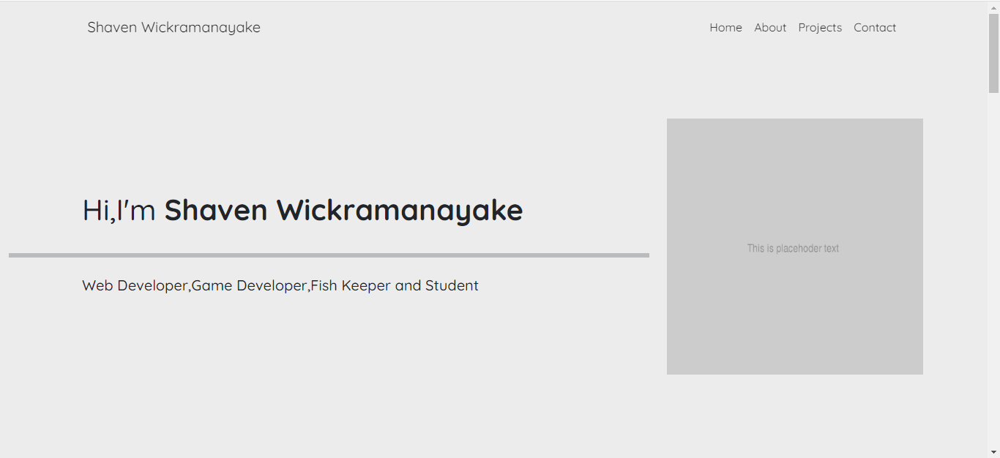

# Shaven Wickramanayake's Personal Website
#### Video Demo:  https://youtu.be/UpLLCWjk1dU
#### Description: The personal website of Shaven Wickramanayake made for CS50, Havard University's introduction to computer science and programming.
#### Technologies Used : 
- HTML 5
- CSS 3
- Javascript(ECMASCRIPT) 6
- SCSS (Compiled to CSS 3)
- Markdown
#### Frameworks Used :
- Bootstrap
- Email.js
- Font Awesome
#### Software Used : 
- Visual Studio Code
- Google Chrome
- Git

So after i finished the last pset Finance i finally had (almost) done CS50 and I was thinking that i'll probably finish the final project (which I had already decide will be my personal website) within a few weeks and have a happily ever after. Turns out i couldn't be any more wrong. So this is how i finished my final project for CS50.

I started the project with high spirits,importing bootstrap and all the other stuff i have done countless times,then I started on the the index.html page.I had already made a single page personal website a few years back when i had just started web dev,it lasted me well but it was definitely in need of an upgrade and since it was all just spaghetti code I decided that building a website from the ground up was better than trying to read through the code monster i had created.

For the main page i settled on having a animated background made with Vanta.js to give it a bit of a wow factor,this was one of the first mistakes i made as I spent the rest of the evening trying to get it to work and eventually finding that i forgot an import statement.After about a month the first page was complete and then i got hit with a major roadblock called exams. I wasn't able to make any progress for about a month and after that i was suddenly dreading coming back to finish the project.As soon as I looked at it I was horrified at my lack of UI design (Nothing new really :<). The Vanta.js background kept users from seeing the text that was in front of it,the "neon borders" I added looked like the website was permanently stuck in the 80s. In short it looked like the most generic and over the top website you will ever see.

So after a while i realized that there were only 3 months left to the year and that if I wanted my certificate i would have to finish this FAST. So i vowed my self that I will make this the best website I have ever made. I first hopped on Behance and searched through some website to find inspiration,a pattern i Noticed in most websites is that they seem to have a shade of black or white as their dominant colors and a few highlights of other colors in between,so after mimicking that and adding features from different website i finally made my **first Website that looks good**.

The next challenge was adding functionality to the contact form in my site. One of the first results that came up when i searched it was to use php but as much as  i tried to couldn't get it to work so i kept searching and i found the solution im using right now, Email.js. It took me about the same time to setup as Vanta.js in my previous website but eventually i have a fully functioning form implemented in javascript. 

And so thats how I made my final project for CS50. This course not only improved my competency as developer but also helped me find a workflow for starting new projects (Which i didn't have before, I just kept adding things till it looked good) and so this is it. My name is Shaven Wickramanayake from Sri Lanka and this was CS50.

*music starts playing with credits
